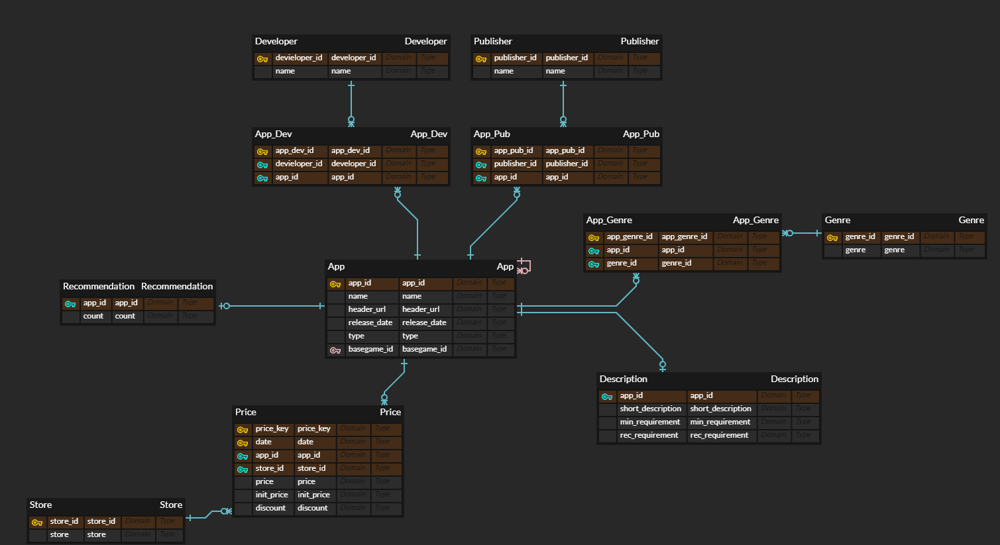

# ERD



- App: GetSteamAppList api에서 제공하는 14만 개 가량의 스팀 게임의 appid와 name을 저장하는 릴레이션
    - **appid**: int, pk, 스팀 게임의 appid
    - name: varchar(65532), 게임의 이름
- Appdetail: appdetails api에서 appid를 통해 조회 가능한 app의 상세 정보
    - **appid:** int, pk, fk(App(appid)) cascade, App 릴레이션에서 참조
    - header_url: varchar(65532), 헤더 이미지의 url
    - release_date: date, 게임의 공개일자
    - type: varchar(50), 게임의 유형(game, dlc 등 자세한 도메인 파악 필요), 도메인이 파악되면 데이터타입 변경이나 별도 릴레이션 생성 등의 조치 가능성도 있음
- DLC: appdetails에서 제공하는 dlc 목록이 다중 값 속성이기 때문에 별도로 분리한 릴레이션
    - **appid**: int, pk, fk(Appdetail(appid)) cascade, dlc를 가지는 원본 게임의 id
    - **dlcid**: int, pk, fk(App(appid)) cascade, dlc의 id
- Price: 날짜의 가격 저장하는 릴레이션
    - **date**: date, pk, 날짜
    - **store**: pk, 어느 곳에서 판매하는 가격인지
    - **appid**:  int, pk, fk(Appdetail(appid)),  게임의 아이디
    - price: 할인이 적용된 현재 판매가
    - init_price: 할인 전 원래 가격
    - discount: 할인율
- Developer: 개발사
    - **devid**: serial, pk, 개발사의 인조키
    - name: varchar(200), 개발사명
- Genre: 게임의 장르
    - **genid**: serial, pk, 장르의 인조키
    - genre: varchar(50), 장르명
- App-Genre: appdetails에서 제공하는 장르 목록이 다중 값 속성이기 때문에 장르 릴레이션과의 관계를 나타내는 릴레이션
    - **appid**
    - **genid**

# SQL

```sql
create table app(
 appid int primary key,
 name varchar(65532) not null);

create table appdetail(
 appid int primary key,
 header varchar(65532),
 release_date date,
 type varchar(50),
 constraint fk_appid
  foreign key(appid)
   references app(appid)
   on delete cascade
);

create table dlc(
 appid int,
 dlcid int,
 primary key(appid, dlcid),
 constraint fk_appid
  foreign key(appid)
   references appdetail(appid)
   on delete cascade
 constraint fk_dlcid
  foreign key(dlcid)
   references app(appid)
   on delete cascade
);
```

# Python

## applist to db

```python
# applist_to_db.py
import psycopg2
import requests
import json

conn = psycopg2.connect(dbname='game', user='postgres',
                        password='mysecretpassword', host='192.168.56.11', port=30080)
cur = conn.cursor()
app_list_get = requests.get("https://api.steampowered.com/ISteamApps/GetAppList/v2/")
app_json = json.loads(app_list_get.text)

for app in app_json["applist"]["apps"]:
    if app["name"]:
        try:
            cur.execute("INSERT INTO app (appid, name) VALUES (%s, %s)", (app["appid"], app["name"]))
        except BaseException as e:
            print(e)
            print(app["appid"], app["name"])
# commit
```

api를 호출해 applist를 받아 db에 저장